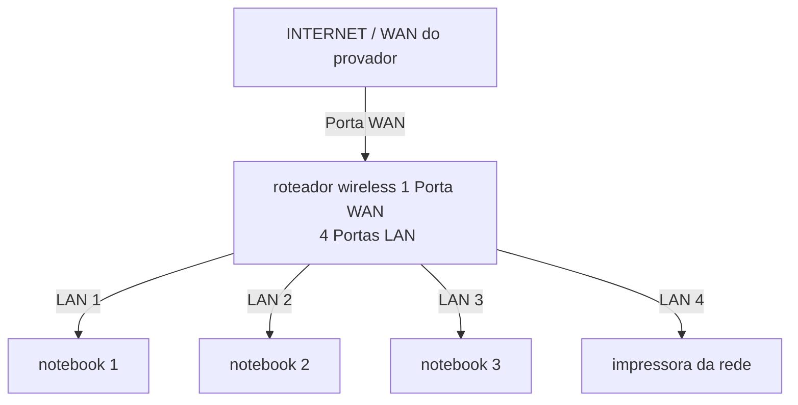

# laboratório de redes 01 - lab-redes01
Projeto desenvolvido na disciplina de redes de computadores no Curso Tecnico de Informática do SENAC

ALUNO: Andy josmar

PROFESSOR: jose de assis 

DATA: 09/03/2026

---

## 1.Objetivo :
Implementar uma rede local simples connectado 3 notebooks a um roteador wireless com switch intregado e uma impressora de rede.

o projeto sera realizada em duas etapas: 

1. Simulação de rede no Ciso Packet Tracer
2. Implementação de r5ede no laboratorio real

---

## 2. Equipamento utilizada neste laboratorio 

  - 3 notebooks
  - 1 roteador wireless com 1 wan e 4 portas LAN
  - 1 Impressora 
  - Cabo de rede

---

## 3. Tropologia da rede 
Diagrama lógica da rede utilizada neste laboratório:

Imagen da topologia utilizada  no laboratorio

---

## 4. Plano de endereçamento IP

Rede: 192.168.0.0/24

Gataeway: 192.168.0.1

| Dispositivo | Tipo de IP | Endereço IP | Observação |
|-------------|-------------|-------------|-------------|
| Roteador | Estatico | 192.168.0.1 | IP do roteador |
| Impressora | Reserve DHCP | 192.168.0.100 | IP reservado pelo reteador 
| PC1 | Reserva DHCP | 192.168.101 | IP reservado pelo roteador |
| PC2 | DHCP | Automático | IP atribuido pelo roteador |

**observação**
- A impressora e um dos notebooks utilizada reserve DHCP.
- O roteador sempre atribuio mesmo endereço IP a esses dispositivo.

---

## 5. Implementação no laboratorio Real 

após a instalação, a rede foi monatada fisicamente no laboratorio.

Etapas realizada 

(FOTO e captura de tela  realizadas durante o laboratorio

TESTE:

(foto e capturas de tela realizadas durante o laboratorio)

---
 
## 6. conclusão

Este laboratório permitiu compreender o funcionamento de uma rede local simples, incluindo:
 - Estrutura de uma rede domestica ou de pequena escritoria 
 - Utilização de um roteador  com porta WAN e portas LAN
 - Funcionamento do DHCP
 - Comunicação entreb dispositivos na rede locla
 - Utilização de uma impressora de rede

 

