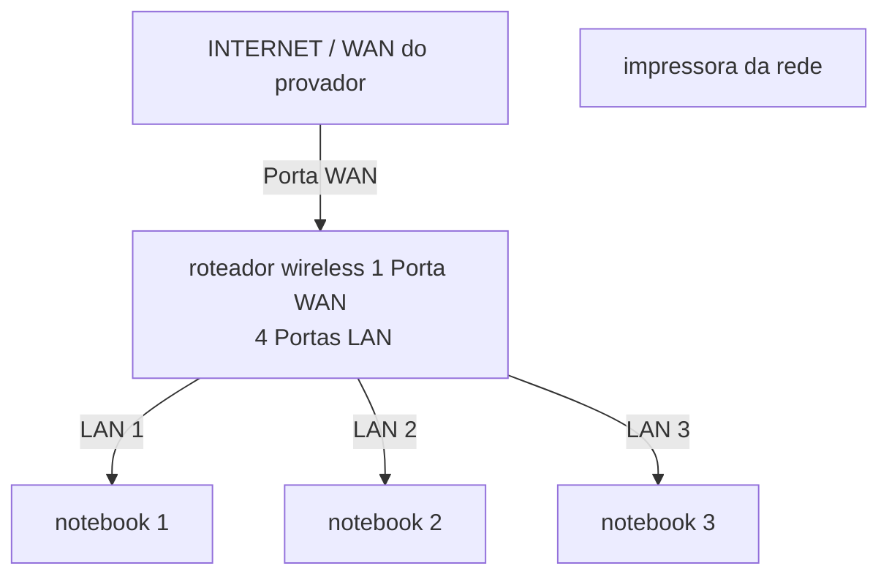

# laboratório de redes 01 - lab-redes01
Projeto desenvolvido na disciplina de redes de computadores no Curso Tecnico de Informática do SENAC

ALUNO: Andy josmar

PROFESSOR: jose de assis 

DATA: 09/03/2026

---

## 1.Objetivo :
Implementar uma rede local simples connectado 3 notebooks a um roteador wireless com switch intregado e uma impressora de rede.

o projeto sera realizada em duas etapas: 

1. Simulação de rede no Ciso Packet Tracer
2. Implementação de r5ede no laboratorio real

---

## 2. Equipamento utilizada neste laboratorio 

  - 3 notebooks
  - 1 roteador wireless com 1 wan e 4 portas LAN
  - 1 Impressora 
  - Cabo de rede

---

## 3. Tropologia da rede 
Diagrama lógica da rede utilizada neste laboratório:

Imagen da topologia utilizada  no laboratorio

